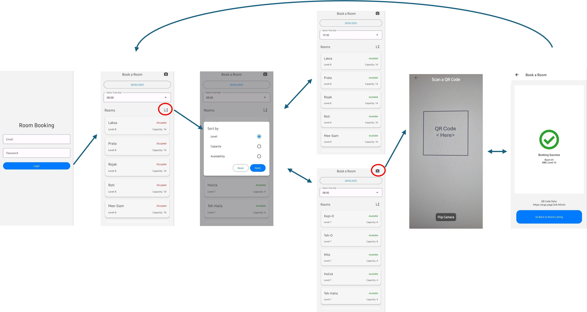

### Room Booking Mobile Application

A React Native Mobile App that demonstrates API Integration, data manipulation and device specific functionality.

This app aims to demonstrate the following:

* Fetches data from a REST API.   
* Sorts and displays the data dynamically.   
* Integrates a device-specific feature (e.g., camera).   
* Includes tests for critical functionality.

### Setup and Run Instructions

[Expo](https://expo.dev) project created with [`create-expo-app`](https://www.npmjs.com/package/create-expo-app).

Pre-requisites: Have some recent version of Node.js installed, Install Expo Go on a physical device (if want to test physically.) 

1. Install dependencies: `npm install`
1. Start app: `npx expo start`
1. To view in 'app view' on a web browser, visit localhost:8081 and toggle device toolbar.
1. To run on android emulator, Press `a`.

To run tests, run:

1. `npm test`

### Other stuff.

#### Project Structure

```
/room-booking-mobile
│── /services           # Services e.g. API call, data fetching
│── /app                # App navigation (File based - file structure determines app navigation)
│── /components         # Reusable components
│── /types              # Global types
│── package.json        # Dependencies and scripts
│── tsconfig.json       # TypeScript config
```

#### Assumptions & Interpretations
- Navigation between screens will be handled using `expo-router`.
- Error handling will be implemented for cases like camera permissions not being granted or scanning failures.
- The UI will be designed with React Native Paper to maintain consistency with Material Design principles.

Flow of Application: 


**Others:**

Project uses [file-based routing](https://docs.expo.dev/router/introduction).
* Use [https://imagecolorpicker.com/](https://imagecolorpicker.com/) to get color from figma to the app.